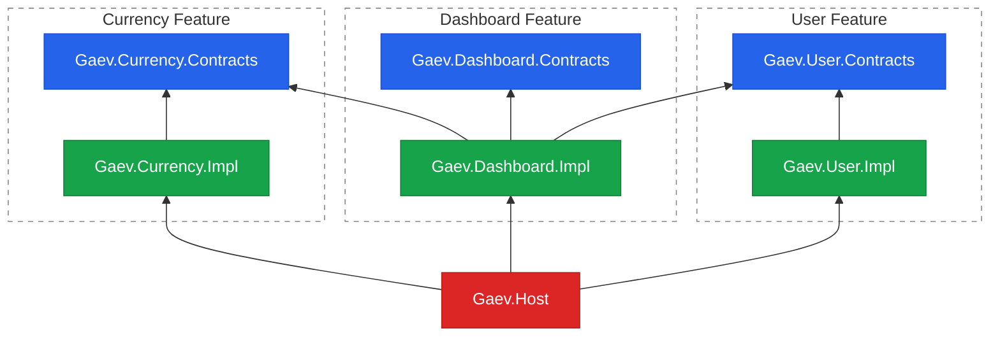

I have been writing .NET for the better part of two decades now, across dozens of projects. Different domains, different teams, different decades — and yet there is one thing I can almost always count on finding when I open a solution: a project called `Core`. Or `Kernel`. Or `Shared`, `Common`, `Utils` — pick your favourite. It is the most reliable constant in our industry, more dependable than a `NullReferenceException` with a callstack that points everywhere except at the actual bug.

{:style="max-width:500px; width:100%;" class="block-center"}

And honestly, it always starts from a good place. You write a helper, then another feature needs it too, so you pull it into a shared library. Reasonable! That is literally what libraries are for. Nobody sits down on day one and decides to build a monster. The monster grows quietly, one innocent `static class` at a time, while everyone is busy shipping features.

<!--more-->

## Problem

Give that shared library a year and it grows a kind of gravity: every new class drifts into it, because dropping something into `Common` is always the path of least resistance. The result is a single project that contains a little bit of everything and a clear picture of nothing. You *know* the helper you need is in there somewhere. Good luck finding it.

Two pains show up, and they reinforce each other:

- **Cognitive overload.** Everything depends on `Common`, and `Common` slowly grows to depend on everything, so the dependency graph turns into a hairball. You can no longer reason about a change in isolation, because there is no isolation left.
- **Ownership.** It is *shared*, so everyone owns it — which is a polite way of saying nobody does. A change in `Common` can ripple into any corner of the system, and the person making it rarely knows every corner. So nobody wants to touch it, and it ossifies.

A big part of how we get here is the habit of splitting code by **technical layer**: `Data`, `Models`, `Services`, `Helpers`. Each feature's bits get smeared across these horizontal buckets, and the buckets become the catch-all libraries by construction. A single "create user" feature ends up scattered across four projects, none of which is *about* users.

### It is never just one shared project

Here is the part that I have watched happen more than once. It rarely stays a single `Common`. The first circular reference forces a split — `Common` wants to call into `DataAccess`, but `DataAccess` already references `Common`, and the compiler refuses to play along. So someone spins off `Common.Core`. Then `Common.Utils`. Then `Shared`, `Shared.Models`, `SharedKernel`, `Company.Framework`… a whole constellation of catch-alls orbiting your solution. Three things follow, and they compound:

- **Dependency hell and cycles.** The reference graph turns to spaghetti, and sooner or later you get something like `Utils → Core → Utils` (or, if these are NuGet packages, the version-conflict flavour of the same headache). The usual "fix" is to merge two of them, which just makes the ball bigger.
- **Convention vacuum.** There is no written rule for *where a new class goes*. Does a fresh DTO belong in `Common.Models`, `Shared.Contracts`, or `Core.Dto`? People pick "wherever it compiles" or copy whatever the neighbour did — cargo-culting that quietly speeds up the entropy.
- **Lost rationale.** *Why is `StringExtensions` in `Core` but `DateExtensions` in `Utils`?* Nobody knows. `git blame` says it moved during some 2019 refactor, and the reason left the company with the developer who did it. This is archaeology, not architecture.

### Naming the beast

There is actually a respectable name for what this *was supposed to be*. In Domain-Driven Design, a [Shared Kernel](https://deviq.com/domain-driven-design/shared-kernel/){:target="_blank"} is a small, deliberately coordinated subset of the model that two teams agree to share — emphasis on *small* and *deliberately coordinated*. A `Common` project is what you get when nobody coordinates and nothing stays small. It is an abused Shared Kernel: a utility library wearing a domain library's clothes. Mixing technical commonality ("we both call `string.IsNullOrEmpty`") with domain sharedness ("we both mean the same thing by *Customer*") is the category error at the root of all this. Left unchecked, it slides into the classic [Big Ball of Mud](https://en.wikipedia.org/wiki/Big_ball_of_mud){:target="_blank"}.

I have started calling this thing **The Black Hole**. Code falls in, every dependency in the solution bends toward it, and nothing ever escapes.

So how do we avoid building a Black Hole? We change the axis we split along.

## Solution

The fix has been hiding in plain sight, in the "D" of SOLID that everyone recites in interviews and far fewer people apply on a Tuesday: the **Dependency Inversion Principle**.

> High-level modules should not import anything from low-level modules. Both should depend on abstractions (e.g., interfaces). Abstractions should not depend on details. Details (concrete implementations) should depend on abstractions. — [Wikipedia: Dependency inversion principle](https://en.wikipedia.org/wiki/Dependency_inversion_principle){:target="_blank"}

In plain English: depend on abstractions, not concretions. Applied to our problem, features depend on each other's *contracts*, never on each other's *implementations*. And then the key reframing on top of DIP:

**Split by business feature, not by technical layer.** One folder per feature, one boundary, one owner. Everything a feature needs lives together, and the only thing it exposes to the outside world is a thin set of interfaces.

Let me make this concrete with a small demo — three features: **User**, **Currency**, and **Dashboard** (the source is [on GitHub](https://github.com/gaevoy/gaev-modular-arch){:target="_blank"}). Each feature is split into two projects:

| Type | Allowed dependencies | Contains |
|---|---|---|
| `*.Contracts` | none | interfaces, records/DTOs |
| `*.Impl` | own Contracts + other Contracts | service classes, `RegistrationExtensions` |
| `Gaev.Host` | all Contracts + all Impl | `Program.cs`, startup wiring |

The whole architecture fits in one picture. `Contracts` projects (blue) depend on nothing; `Impl` projects (green) depend on their own contracts plus *other features' contracts*; the `Host` (red) sits on top and is the only thing that knows about implementations at all:



### The contract is the public API

A `Contracts` project holds only interfaces and DTOs, and references nothing. This is the feature's entire public surface:

```csharp
// Gaev.User.Contracts — the feature's public API, zero dependencies
public interface IUserService
{
    Task<UserDto?> GetUser(Guid id);
    Task<IEnumerable<UserDto>> ListUsers();
    Task<UserDto> CreateUser(CreateUserRequest request);
}

public record UserDto(Guid Id, string Name, string Email);
public record CreateUserRequest(string Name, string Email);
```

### The implementation stays private

The concrete logic lives in the `Impl` project. Notice the class is `internal sealed` — nothing outside the assembly can even see it, only the `IUserService` interface it implements:

```csharp
// Gaev.User.Impl — internal, so the outside world only ever sees IUserService
internal sealed class UserService : IUserService
{
    private readonly Dictionary<Guid, UserDto> _store = new();

    public Task<UserDto?> GetUser(Guid id) =>
        Task.FromResult(_store.TryGetValue(id, out var u) ? u : null);

    public Task<IEnumerable<UserDto>> ListUsers() =>
        Task.FromResult<IEnumerable<UserDto>>(_store.Values);

    public Task<UserDto> CreateUser(CreateUserRequest request)
    {
        var user = new UserDto(Guid.NewGuid(), request.Name, request.Email);
        _store[user.Id] = user;
        return Task.FromResult(user);
    }
}
```

That `internal sealed` is a deliberate choice, and it makes the boundary tangible: the concrete type is invisible outside its own assembly, so the *only* way to get an instance is to ask the container for the interface. When a test needs to reach the concrete class directly, `[InternalsVisibleTo("MyFeature.Tests")]` is the escape hatch.

### Cross-feature calls go through contracts only

Here is where DIP earns its keep. The `Dashboard` feature needs both users and currency conversion. Its service takes `IUserService` and `ICurrencyService` in the constructor — both from *contracts* assemblies — and never imports another feature's `Impl`:

```csharp
internal sealed class DashboardService : IDashboardService
{
    private readonly IUserService _users;
    private readonly ICurrencyService _currency;

    public DashboardService(IUserService users, ICurrencyService currency)
    {
        _users = users;
        _currency = currency;
    }

    public async Task<DashboardDto> GetDashboard()
    {
        var users = await _users.ListUsers();
        var conversion = _currency.Convert(100m, "USD", "EUR");
        var summary = $"100 USD = {conversion.Result} EUR (rate {conversion.Rate})";
        return new DashboardDto(users.Count(), summary);
    }
}
```

And this is the punchline of the whole approach — **the boundary is enforced by the `.csproj`, not by code review.** Here are the only projects that `Gaev.Dashboard.Impl` references in its `.csproj`:

```xml
<ItemGroup>
  <ProjectReference Include="..\Gaev.Dashboard.Contracts\Gaev.Dashboard.Contracts.csproj" />
  <ProjectReference Include="..\..\user\Gaev.User.Contracts\Gaev.User.Contracts.csproj" />
  <ProjectReference Include="..\..\currency\Gaev.Currency.Contracts\Gaev.Currency.Contracts.csproj" />
</ItemGroup>
```

Three references, all of them `*.Contracts`. There is simply no `<ProjectReference>` to `Gaev.User.Impl`, so `DashboardService` *physically cannot* reach into another feature's internals and call `new UserService()`. It is not a guideline you have to remember in a pull request — it is the compiler saying no. That is the difference between a convention and a boundary.

### One wiring hook per feature

So far nothing has plugged these implementations into the application. Each `Impl` project does that through exactly one `RegistrationExtensions` class with two methods — one to register services, one to map endpoints. This is the single hook a feature offers to the host:

```csharp
// Gaev.User.Impl/RegistrationExtensions.cs
public static class RegistrationExtensions
{
    public static IServiceCollection AddUserFeature(this IServiceCollection services)
    {
        services.AddSingleton<IUserService, UserService>();
        return services;
    }

    public static WebApplication UseUserFeature(this WebApplication app)
    {
        app.MapGet("/users", async (IUserService svc) =>
            Results.Ok(await svc.ListUsers()));

        app.MapPost("/users", async (CreateUserRequest req, IUserService svc) =>
        {
            var user = await svc.CreateUser(req);
            return Results.Created($"/users/{user.Id}", user);
        });

        return app;
    }
}
```

Notice it is `public` — and it is the *only* `public` class in the entire `Impl` project; everything else, `UserService` included, stays `internal`. So a feature exposes exactly two things to the outside world: its `Contracts` (the *what*) and this one `RegistrationExtensions` class (the *how to switch it on*). `AddUserFeature` is the single place that knows `IUserService` is backed by `UserService`, binding the contract to its private implementation.

### The host wires it all together

The host is where every feature comes together. `Program.cs` calls each feature's two methods and nothing else — it orchestrates without knowing a single concrete type:

```csharp
var builder = WebApplication.CreateBuilder(args);
builder.Services
    .AddUserFeature()
    .AddCurrencyFeature()
    .AddDashboardFeature();

var app = builder.Build();
app.UseUserFeature();
app.UseCurrencyFeature();
app.UseDashboardFeature();
app.Run();
```

At runtime the built-in DI container resolves the concrete `UserService` and `CurrencyService` and injects them into `DashboardService` automatically. The host knows about everything precisely so that nothing else has to.

### The folder is the feature

There is a quieter benefit that shows up once the code settles. Because each feature *is* a folder — `features/user/`, `features/currency/`, `features/dashboard/` — that folder becomes the obvious home for *everything* about the feature, not just its code. The architecture diagrams, the README that explains the domain, the ADRs (architecture decision records) that capture *why* a choice was made, the feature's tests, and a `CODEOWNERS` entry that assigns a real, named owner — they all live side by side. Onboarding a teammate stops being "grep the whole solution" and becomes "read this one folder." That same folder is now the natural entry point for AI tooling too: Copilot and Claude Code can load one self-contained feature — its code, its README, its ADRs — and reason about how it works without dragging half the solution into their context. Tighter boundaries mean a smaller, cleaner window of *relevant* code, so the answers are sharper and the noise stays out. And once ownership has a physical address, it stops being everyone's-and-therefore-no-one's — which is the exact problem we started with.

## How this compares to the usual suspects

None of this is a brand-new architecture I am unveiling. It is a [Modular Monolith](https://www.kamilgrzybek.com/blog/posts/modular-monolith-primer){:target="_blank"} organized **by feature**, with a **contract/impl split**, and **DIP** holding the boundary in place. Still, it is worth knowing where it sits next to the names people throw around in design reviews — so you can answer the inevitable "but isn't this just Clean Architecture?" question.

| Approach | Organizing idea | Pros | Cons |
|---|---|---|---|
| **The Black Hole** (catch-all `Core`/`Common` — an abused DDD Shared Kernel — *the "before"*) | One shared project every feature references, then several of them | Reuse is instant; one obvious home for cross-cutting helpers | Grows unbounded; multiplies into cyclic dependency-hell spaghetti; owned by everyone = owned by no one; no rule for where classes go; one change ripples everywhere |
| [Layered](https://en.wikipedia.org/wiki/Multitier_architecture){:target="_blank"} / package-by-layer | Group by technical role: `Data`, `Services`, `Models` | Familiar, fast to start | Features smeared across layers; breeds `Core`/`Shared` dumping grounds; no per-feature owner |
| [Clean](https://blog.cleancoder.com/uncle-bob/2012/08/13/the-clean-architecture.html){:target="_blank"} / Onion | Concentric layers, dependencies point inward to the domain | Domain isolated from I/O; testable core | Ceremony-heavy; tells you *how to layer*, not *how to split features* |
| [Hexagonal](https://en.wikipedia.org/wiki/Hexagonal_architecture_(software)){:target="_blank"} (Ports & Adapters) | Domain core + ports (interfaces) + adapters (impls) | Swappable I/O; tech-agnostic core | Same gap on feature split; overkill for small apps |
| [Vertical Slice](https://www.jimmybogard.com/vertical-slice-architecture/){:target="_blank"} | Organize end-to-end by request/feature | High cohesion, little indirection | Boundaries by convention — they drift unless enforced |
| **Compiler-Enforced Modular Monolith** (this post) | Feature modules, `Contracts`/`Impl` split, wired in a host | One folder = one owner; boundary enforced by project refs; extract to a service later with little churn | More projects; DI wiring lives in the host |

If I had to give our flavour a name, I would call it a **Compiler-Enforced Modular Monolith** — because what holds the boundaries in place is not discipline or code review but the compiler itself: an `Impl` has no project reference to reach across with, so the wall stands on its own. The structural trick behind that guarantee is contract-first — each feature's `*.Contracts` project *is* its public API, its port, while `*.Impl` stays private. (If you prefer a name that describes the structure rather than the guarantee, *Contract-First Modular Monolith*.)

The important bit: **these compose, they do not compete.** Clean and Hexagonal answer "how do I structure the *inside* of a module"; this answers "how do I split the system into modules and stop them reaching into each other." The `*.Contracts` project *is* the Hexagonal "port", just applied per feature. If one feature's `Impl` grows hairy, run Clean Architecture *inside* it — the boundary at the edge does not care what you do behind it.

## Takeaways

- Catch-all `Core`/`Shared`/`Common` libraries scale badly: no clear contents, no clear owner. Do not feed The Black Hole.
- Slice by **business feature**, not by technical layer. One folder = one boundary = one owner.
- Make `*.Contracts` the only thing features share, and keep `*.Impl` private.
- Let **project references be the guardrail** — the compiler enforces the boundary for free, with zero discipline required.
- DIP is not just an interview answer; the host wiring is where you actually get to apply it.
- It **composes** with Clean and Hexagonal — use them inside a feature's `Impl`; the `Contracts` boundary does not mind.
- This is a baseline, not dogma. Stepping away from it is perfectly fine — just estimate the risk before you do.

## Useful Links

- [Source code](https://github.com/gaevoy/gaev-modular-arch){:target="_blank"} — the full .NET demo
- [Dependency Inversion Principle](https://en.wikipedia.org/wiki/Dependency_inversion_principle){:target="_blank"} — the "D" in SOLID
- [SOLID](https://en.wikipedia.org/wiki/SOLID){:target="_blank"} — the five principles
- [Hexagonal architecture](https://en.wikipedia.org/wiki/Hexagonal_architecture_(software)){:target="_blank"} — also covers Clean and Onion as variants
- [Multitier (layered) architecture](https://en.wikipedia.org/wiki/Multitier_architecture){:target="_blank"}
- [Vertical Slice Architecture](https://www.jimmybogard.com/vertical-slice-architecture/){:target="_blank"} — Jimmy Bogard
- [Modular Monolith](https://www.kamilgrzybek.com/blog/posts/modular-monolith-primer){:target="_blank"} — Kamil Grzybek
- [Shared Kernel (DDD)](https://deviq.com/domain-driven-design/shared-kernel/){:target="_blank"} — what `Common` was supposed to be
- [Big Ball of Mud](https://en.wikipedia.org/wiki/Big_ball_of_mud){:target="_blank"} — what it becomes instead

Have you tried slicing your monolith by feature like this, or are you still wrestling with a Black Hole of your own? I would love to hear how it went — drop a comment below.
