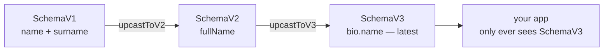

Backend and frontend developers are supposed to be different species. I've spent enough time on both sides of the same products to suspect we mostly just borrow each other's tricks and rename them. Something I reach for constantly on the backend keeps turning out to be exactly what I needed on the frontend, and the other way round.

This post is about one of those crossings: **upcasting** — a technique I first met in backend event sourcing — pointed at a very frontend problem. Namely, changing the shape of the state you persist, over and over, without filing a ticket with the backend team every single time.

<!--more-->

## Problem

Picture an app that saves user records — profiles, a team roster, a contacts page. You persist each one through an API, a plain `PUT /users/:id`, and on the server it lands in a column as a string. Nobody on the backend parses it; to the database it's an opaque blob. Very convenient, right up until the day you want to *change its shape*.

Say each user started life storing `name` and `surname`, and now you'd rather keep a single `fullName`. On paper it's a two-minute rename. In practice:

- You can't touch the database — you don't have access, and frankly you don't want it.
- So a backend developer writes a SQL script to rewrite every stored blob into the new shape.
- And running that script has to be timed with your release, because the old frontend reads the old shape while the new one reads the new shape. Run it too early and you break production; too late and the new code chokes on old data.

You've turned a field rename into a cross-team, cross-pipeline event with a maintenance window. Do that a few times and you quietly stop changing the schema at all — which is the real cost.

Underneath it all is a fact that's easy to forget: **the data outlives the code that wrote it.** Every blob you've ever saved is still sitting there in exactly the shape it had the day it was written. Changing the code doesn't change the data — it just guarantees a mismatch between the two.

## Solution

Here's the reframe from event sourcing: **don't migrate the stored data at all.** Leave every blob exactly as it was written, and instead teach your app to transform any old shape into the current one as it reads. That read-time transform is called **upcasting**. The store stays a museum of old versions; the rest of your code only ever sees the latest schema.

Let me walk through it with three versions of a user's schema.

### Tag every version

First, give every version a number that travels *inside* the data. A discriminated union keeps this honest — TypeScript can tell the versions apart by their `schemaVer` tag:

```typescript
type SchemaV1 = {
  schemaVer: 1;
  name: string;
  surname: string;
};

type SchemaV2 = {
  schemaVer: 2;
  fullName: string;
};

type SchemaV3 = {
  schemaVer: 3;
  bio: {
    name: string;
  };
};

type AnySchema = SchemaV1 | SchemaV2 | SchemaV3;
```

In the wild, the store holds a mix of all three at once — users saved last year look nothing like users saved this morning:

```typescript
const apiResults: Record<string, AnySchema> = {
  userA: { schemaVer: 1, name: 'John', surname: 'Doe' },
  userB: { schemaVer: 2, fullName: 'John Doe' },
  userC: { schemaVer: 3, bio: { name: 'John Doe' } },
};
```

Three users, three different versions, all valid. That's the normal, healthy state of a store that's been around for a while — not a bug to fix.

### One small step per version

Now, one function per hop. Each takes exactly one version and returns the next — nothing more. Small, pure, and boring enough to test in your sleep:

```typescript
function upcastToV2(data: SchemaV1): SchemaV2 {
  return {
    schemaVer: 2,
    fullName: `${data.name} ${data.surname}`,
  };
}

function upcastToV3(data: SchemaV2): SchemaV3 {
  return {
    schemaVer: 3,
    bio: {
      name: data.fullName,
    },
  };
}
```

Keeping each step to a single version is the part that scales. When V4 arrives you write one more `upcastToV4` and leave the older steps alone — you never reopen logic you already got right.

### Chain to the latest

Then a single `upcast()` walks a blob of *any* version up to the newest by chaining those hops:

```typescript
function upcast(data: AnySchema): SchemaV3 {
  switch (data.schemaVer) {
    case 1:
      return upcastToV3(upcastToV2(data));
    case 2:
      return upcastToV3(data);
    default:
      return data;
  }
}
```

A version-1 blob runs through both steps; a version-2 blob through one; a version-3 blob is already home, so it falls through untouched.

### Upcast at the boundary

Finally, do it once, at the edge — right where the API data enters your app:

```typescript
const upcastedApiResults = Object.keys(apiResults).reduce<Record<string, SchemaV3>>(
  (accumulator, key) => {
    accumulator[key] = upcast(apiResults[key]);
    return accumulator;
  },
  {},
);
```

Everything downstream is now `SchemaV3`, and nothing has to know the other versions ever existed. This is the frontend take on *parse, don't guess*: instead of sprinkling `if (schemaVer === 1)` checks through your components, you parse the untyped blob into one known type at the boundary and hand the rest of the app a guarantee.



The whole shape change now lives in your codebase: no SQL, no ticket, no window timed with another team. The cost you take on instead is carrying those upcasters around — we'll get to that.

### Saving makes the upgrade stick

There's a useful side effect worth spelling out. Upcasting is *virtual* — it happens on read and evaporates — right up until the moment you **save**. Because the app always writes the latest shape, saving an upcasted record quietly rewrites it as V3 in the store.

So any given record is only upcast *until its next save*. After that it comes back already current, and the transform never runs for it again. Your store migrates itself, lazily, as people actually use the app — no big-bang script, no backend involved, no maintenance window. The old versions don't get converted in a heroic overnight batch; they just fade out one ordinary save at a time.

(This isn't hypothetical plumbing, by the way — zustand's `persist` performs exactly this write-back automatically after a migration. More on that two sections down.)

One caveat before moving on: this works cleanly because *one* client owns the blob. If some other consumer still reads the raw stored data and expects an old shape, upcasting on read won't help it — you'd keep that reader tolerant, or **downcast on write** (store the old and new shapes side by side for a transition). That's the [Expand and Contract](https://martinfowler.com/bliki/ParallelChange.html){:target="_blank"} move, and it's the same "downcasting" idea from the *parse, don't guess* article below.

## An old backend trick

None of this is new — it's just under-used on the frontend. On the backend, upcasting is a well-worn answer to the same question ("how do I evolve data that's already written?"):

- **Event sourcing** turned it into a named pattern. An event store keeps events forever, so you can't rewrite them; instead you register an **upcaster chain** that walks each old event up to the current version on the way out. [Axon](https://docs.axoniq.io/axon-framework-reference/5.1/events/event-versioning/){:target="_blank"}, [Marten](https://event-driven.io/en/event_versioning_with_marten/){:target="_blank"} and RailsEventStore all ship it as a built-in feature; with EventStoreDB you wire the same thing in client code. The research even has a tidy taxonomy of the options — versioned events, weak schema, upcasting, in-place transformation, copy-and-transform — in [*The Dark Side of Event Sourcing*](https://www.movereem.nl/files/2017SANER-eventsourcing.pdf){:target="_blank"}.
- **Serialization formats** bake it into the wire. [Avro](https://docs.confluent.io/platform/current/schema-registry/fundamentals/schema-evolution.html){:target="_blank"} resolves an old writer's schema against the new reader's using defaults and aliases; Protobuf leans on field numbers so names can change freely. It's schema evolution with the reader doing the reconciling — upcasting by another name.

The point isn't to name-drop. It's that the shape of the solution is proven, and — as it happens — your own frontend tools already ship it too.

## The same pattern, with zustand

If you keep persisted state in [zustand](https://zustand.docs.pmnd.rs/reference/middlewares/persist){:target="_blank"}, you don't have to hand-roll the wiring — the `persist` middleware already does versioned migration, and it works without React (there's a plain `zustand/vanilla` store), so the example stays pure TypeScript.

The nice part: the `upcastToV2` / `upcastToV3` / `upcast()` functions from above don't change at all. You hand them to `persist` and it decides *when* to run them.

```typescript
import { createStore } from 'zustand/vanilla';
import { persist, createJSONStorage } from 'zustand/middleware';

// Your existing API calls — GET/PUT the opaque string. getItem/setItem may be
// async; zustand handles the promises.
declare function apiGet(key: string): Promise<string | null>;
declare function apiSet(key: string, value: string): Promise<void>;
declare function apiRemove(key: string): Promise<void>;

// A string storage backed by your API instead of localStorage.
const apiStorage = {
  getItem: (name: string) => apiGet(name),
  setItem: (name: string, value: string) => apiSet(name, value),
  removeItem: (name: string) => apiRemove(name),
};

const userStore = createStore<SchemaV3>()(
  persist(() => ({ schemaVer: 3, bio: { name: 'John Doe' } }), {
    name: 'userA',
    version: 3,
    storage: createJSONStorage(() => apiStorage),
    migrate: (persisted, version) =>
      // zustand keeps the version on the envelope; our upcast() reads it inline,
      // so stitch it back on and reuse the very same function.
      upcast({ ...(persisted as object), schemaVer: version } as AnySchema),
  }),
);
```

When the stored `version` doesn't match the configured `3`, zustand runs `migrate`, uses the result as state, and then — this is the "saving makes the upgrade stick" behaviour from earlier — writes the upgraded value straight back to storage. That's the lazy self-migration from earlier, done for you rather than by hand.

Two honest caveats, so this doesn't read as a sales pitch:

- The library gives you the *plumbing* — the version check, the trigger, the write-back — but you still write the transforms. `migrate` is one function you branch inside, not an auto-composed chain; that's the `upcast()` you already wrote.
- `persist` wraps your value in its own `{ state, version }` envelope, so the blob in storage is `{"state":…,"version":3}`, not your raw domain JSON. Fine if you own the blob end to end. If the backend or another consumer expects a specific raw shape, you map to and from it inside the storage adapter — the wrapper doesn't come off for free.

Same idea lives in [redux-persist](https://github.com/rt2zz/redux-persist/blob/master/docs/migrations.md){:target="_blank"} (`version` + `migrations` + `createMigrate`), and the browser ships a cruder cousin in IndexedDB's `onupgradeneeded` — though that one is eager on a version bump, not lazy on read.

## Alternatives

Upcasting isn't the only way to handle a shifting schema. It's one point on a spectrum:

| Approach | How it works | Pros | Cons |
|---|---|---|---|
| **Backend SQL migration** (eager) | A backend dev rewrites every stored blob in place, run on a coordinated release | Store ends up in one clean shape | Needs DB access and another team; timed with your release — the pain we started with |
| **Versioned API endpoints** | Server owns the schema and serves `/v1`, `/v2`, … | Explicit, negotiated contract | Still backend-owned and coordinated; heavy for a UI preferences blob |
| **Additive-only** ([Tolerant Reader](https://martinfowler.com/bliki/TolerantReader.html){:target="_blank"}) | Only ever add optional fields; readers ignore what they don't recognise | Cheap, no migration at all | Schema rots — you can add, but never rename or restructure |
| **Expand & Contract** ([Parallel Change](https://martinfowler.com/bliki/ParallelChange.html){:target="_blank"}) | Write old and new together, migrate readers, then drop old | Safe when several consumers read the blob | Transition bookkeeping; you maintain both shapes for a while |
| **Upcast on read** (this post) | Transform any old shape to the latest at the boundary | Frontend-owned; restructure freely; migrates itself on save | A growing chain of upcasters to carry and test; the store holds every version, so server-side querying is hard |

Which one fits depends on who else reads the data. The moment more than one independent consumer touches the raw blob, upcasting-on-read alone stops being enough and you drift toward Expand & Contract.

## Gotchas

Upcasting earns its keep, but it isn't free — here's what to keep an eye on:

- **The chain grows.** Every version you've ever shipped needs a hop to the next. Saves keep it in check — actively used records upgrade themselves — but a blob that's never touched again keeps its ancient shape forever, so the oldest upcasters never quite die. Budget for a slowly lengthening chain.
- **You can't delete history.** As long as a V1 blob *might* still exist, the code that understands V1 has to stay. Upcasting trades a one-off data migration for a permanent bit of code.
- **Querying the raw store gets hard.** Because old blobs are never rewritten, the store holds every version at once. Anything that reads it *past* your app — a SQL `WHERE`, an analytics job, a report, an admin tool — has to understand all of them or it silently misses rows: a filter on `fullName` won't match the V1 records that still carry `name` + `surname`, nor the V3 ones tucked under `bio`. Upcasting runs in the client, so it can't help a database that's asked to search those shapes directly.
- **Test every hop.** Each upcaster is a pure function from one shape to the next — ideal for a small table of fixtures. It's the frontend cousin of [how I test serialization and deserialization](/2019/06/27/how-to-test-serialization.html) on the backend.
- **Let the compiler catch a missing hop.** Swap the loose `default` for an exhaustiveness check, so adding `SchemaV4` without an `upcastToV4` is a red squiggle instead of a production surprise:

```typescript
function upcast(data: AnySchema): SchemaV3 {
  switch (data.schemaVer) {
    case 1:
      return upcastToV3(upcastToV2(data));
    case 2:
      return upcastToV3(data);
    case 3:
      return data;
    default: {
      const _exhaustive: never = data;
      return _exhaustive;
    }
  }
}
```

- **Upcast in exactly one place.** The whole point is that the rest of the app never sees `schemaVer`. The day you find a version check inside a component, the boundary has sprung a leak.

## Takeaways

- If your API stores state as an opaque string, *you* own that schema — the backend just holds the bytes.
- Tag each version, write one pure upcaster per hop, and chain up to the latest at the boundary.
- Upcasting is virtual on read, but saving persists the upgrade, so the store migrates itself and old versions fade as records get used.
- It takes the backend team and the SQL script out of a routine shape change — at the price of a growing set of upcasters you keep and test.
- It's the same pattern the backend has leaned on for years and your own tools already ship. Not exotic — just relocated.

## Useful Links

- [Parse, don't guess](https://event-driven.io/en/parse_dont_guess/){:target="_blank"} — Oskar Dudycz, on parsing untyped data into typed models at the boundary (and up/downcasting)
- [Parse, don't validate](https://lexi-lambda.github.io/blog/2019/11/05/parse-don-t-validate/){:target="_blank"} — Alexis King, the origin of the phrase
- [Event Versioning](https://docs.axoniq.io/axon-framework-reference/5.1/events/event-versioning/){:target="_blank"} — Axon's upcaster chain
- [Event Versioning with Marten](https://event-driven.io/en/event_versioning_with_marten/){:target="_blank"} — upcasting on read in .NET
- [The Dark Side of Event Sourcing](https://www.movereem.nl/files/2017SANER-eventsourcing.pdf){:target="_blank"} — the schema-evolution taxonomy (SANER 2017)
- [Schema Evolution](https://docs.confluent.io/platform/current/schema-registry/fundamentals/schema-evolution.html){:target="_blank"} — Confluent/Avro compatibility modes
- [redux-persist migrations](https://github.com/rt2zz/redux-persist/blob/master/docs/migrations.md){:target="_blank"} and [zustand persist](https://zustand.docs.pmnd.rs/reference/middlewares/persist){:target="_blank"} — the same pattern in your state library
- [Tolerant Reader](https://martinfowler.com/bliki/TolerantReader.html){:target="_blank"} and [Parallel Change](https://martinfowler.com/bliki/ParallelChange.html){:target="_blank"} — Martin Fowler
- [Data serialization fundamentals](https://roninsway.dev/article/fe4f0735c499){:target="_blank"} — related reading on schema and serialization

Have you smuggled a backend pattern into your frontend — or the other way round? I'd like to hear which one, and whether it survived contact with production. Drop a comment below.
