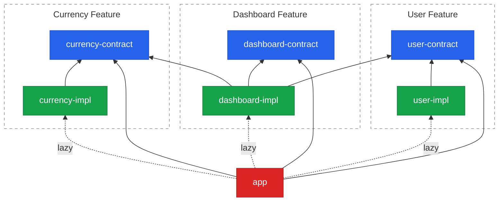

We like to imagine the backend and the frontend are built by two different kinds of engineer, with two different sets of instincts. Spend enough time crossing between them and that starts to look like a costume difference. The good ideas travel in both directions — we just give them new names on arrival and take the credit.

This post follows one idea across. It's the **Dependency Inversion Principle**, the "D" in SOLID, and the twist is where it gets applied: not between two classes in the textbook diagram, but between two *bundles*. A feature will depend on a contract, and the code that actually runs will be resolved at runtime and shipped as its own chunk.

It's a funny principle to hang a frontend post on, because nobody asks a frontend candidate about SOLID. The interview has more pressing business: why `useEffect` fires twice in StrictMode, whether `==` and `===` really differ, and how to center a div. The "D" never comes up — not because the candidate couldn't answer it, but because the interview never gets that far.

<!--more-->

## Problem

Every frontend codebase grows the same organ: a folder called `shared/`, or `utils/`, or `common/`, or `components/common/`. It starts empty and reasonable. Then it becomes the cheapest place to put anything more than one screen touches, and cheap things accumulate. Give it a year and it has its own gravity — new code falls toward it, because that's where the last person put the thing it resembles.

Two costs show up as it grows:

- **Cognitive load.** Everything imports from `shared/`, and `shared/`, over time, imports from everything. The dependency graph stops being a tree and becomes a hairball; you can't reason about one corner of it without dragging in the rest.
- **Ownership.** "Shared" means everyone owns it, which in practice means no one does. There's no name to put in `CODEOWNERS` next to a folder that belongs to every team at once.

That much isn't specific to React. Four things make it a *React* problem in particular.

**1. Every tutorial teaches package-by-layer.** `components/`, `hooks/`, `services/`, `utils/`, `types/` is the default shape of `src/`. A single "user" feature gets smeared across five folders, none of which is *about* users — its component here, its hook there, its service somewhere else. The dumping ground isn't an accident you drifted into; it's the scaffold you started from.

**2. Nothing physically stops an import.** TypeScript has no `internal`, no package-private visibility, no way to mark a module as off-limits. `import { UserService } from '../../features/user/UserService'` compiles, typechecks, and ships. Every module in the repo is reachable from every other by a relative path, so "don't import that" is a code-review opinion, not a rule the machine can hold.

**3. Barrel files are a boundary that isn't one.** An `index.ts` re-exporting a folder *looks* like a public API, but it re-exports everything — it hides nothing. It invites circular imports (a file imports the barrel, which imports the file), and it defeats tree-shaking, so pulling in one symbol can drag the whole chunk along with it. This is well-trodden ground — see [tkdodo's "Please Stop Using Barrel Files"](https://tkdodo.eu/blog/please-stop-using-barrel-files){:target="_blank"} and the long-running [Next.js tree-shaking issue](https://github.com/vercel/next.js/issues/12557){:target="_blank"}. The rule of thumb worth keeping: a barrel belongs at the *published edge* of a package, not inside app code.

**4. On the frontend, coupling has a runtime price.** This is the one that turns an aesthetic complaint into an urgent one. A stray import isn't just an architectural smell — it's bytes, downloaded by every user on every route. You reach for `React.lazy` and a dynamic `import()`, get a clean code split, and feel good about it. Then, months later, someone adds one innocent static import from a shared module. The split quietly collapses back into the main chunk. The build still passes. The tests still pass. Nobody notices, because the only symptom is a slightly bigger download. Architectural erosion here is *measurable in the Network tab*, which is unusual — and it means the real problem isn't *getting* a code split, it's *keeping* one.

The fix to all four is the same change of axis: **organize by business feature, not by technical layer.** One folder per feature, and a boundary around it strong enough that the bundler respects it too. Here's how the demo does that.

## Solution

Start from the principle. The [Dependency Inversion Principle](https://en.wikipedia.org/wiki/Dependency_inversion_principle){:target="_blank"} says:

> High-level modules should not depend on low-level modules. Both should depend on abstractions (e.g. interfaces).
>
> Abstractions should not depend on details. Details (concrete implementations) should depend on abstractions.

Applied at the bundle level, that becomes a single rule: **features depend on each other's *contracts*, never on each other's *implementations*.** The abstraction a feature exposes is a small TypeScript package of interfaces and symbols; the code that satisfies it lives in a separate package that nothing imports directly.

The [demo](https://github.com/gaevoy/gaev-modular-arch/tree/main/react){:target="_blank"} has three features — **User**, **Currency**, and **Dashboard** — laid out with npm workspaces. Each feature is two packages, and the app is a third kind:

| Type | Allowed dependencies | Contains |
|---|---|---|
| `*-contract` | none | interfaces, props types, hook types, IoC symbols |
| `*-impl` | own contract + other contracts + container | services, components, hooks, `register.ts` |
| `@gaev/app` | container + all contracts | `bootstrap.ts`, `App.tsx` |

The dependency graph falls out of that table. Solid arrows are static, build-time dependencies; dashed arrows are lazy runtime loads through a dynamic `import()`. Every package is scoped `@gaev/`; the diagram drops the prefix to keep the boxes readable:



**Legend:** blue — contract (interfaces, types, symbols) · green — impl (services, components, hooks) · red — app (wiring). Every static arrow points at a contract; the only arrows into an impl are dashed. Notice `dashboard-impl` depends on `user-contract` and `currency-contract`, never on their impls.

### The contract is the public API

A feature's contract package is pure TypeScript — it describes *what the feature is* and nothing about how it works. One file per concept; here are the two most React-flavoured ones, a component's props and a hook's signature:

```ts
// user-contract/src/UserAvatarProps.ts — a component
export interface UserAvatarProps {
    userId: string;
    size?: 'sm' | 'md' | 'lg';
}
export const USER_AVATAR = Symbol.for('@gaev/user/USER_AVATAR');

// user-contract/src/UseCurrentUser.ts — a hook
export type UseCurrentUser = () => { user: IUser | null; loading: boolean };
export const USE_CURRENT_USER = Symbol.for('@gaev/user/USE_CURRENT_USER');

// …IUserService and UserPageProps follow the same shape: a type plus its symbol.
// IUser is a plain data interface — no symbol, nothing resolves it.

// user-contract/src/symbols.ts — everything the feature can hand out
export const USER_SYMBOLS: symbol[] = [USER_SERVICE, USER_AVATAR, USE_CURRENT_USER, USER_PAGE];
```

The package's `index.ts` re-exports these with `export *` — a barrel, but the legitimate kind: it sits at the *published edge* of a package, which is exactly where the rule of thumb from earlier says a barrel belongs.

Two details are doing quiet work here:

- **The contract never imports React.** `UserAvatarProps` is a plain object type, not `React.FC` props. The impl package — which imports React anyway — is the one that composes `ComponentType<UserAvatarProps>` at its own call site. Keeping React out of the contract keeps it a pure description of *what a feature is*, resolvable by anything, testable without a renderer.
- **`Symbol.for()` uses the global symbol registry.** `Symbol.for('@gaev/user/USER_AVATAR')` returns the same symbol for a given key no matter who calls it. Nothing in *this* build needs that: one Rollup build means one module instance of the contract package, so a plain `Symbol()` would have the same identity in `user-impl` and `dashboard-impl` alike. `Symbol.for` makes identity independent of that assumption — it survives a second build, a separately-deployed bundle, a script tag. It's insurance against the day the graph stops being one graph, bought for the cost of typing four extra characters.

### An entry point that exports nothing

TypeScript gives you no way to mark a module internal. So the demo inverts the barrel. The entry point of an impl package, `user-impl/src/index.ts`, is a single line:

```ts
import './register';
```

It exports *nothing at all*. There is no name to import, so no consumer can reach in and grab `UserService` or `UserAvatar` directly — the only way in is through the container, which `register.ts` wires up as a side effect of that import. It's the same file name as the barrel from the Problem section, doing the opposite job: a normal barrel exposes everything; this one exposes nothing and just announces "I'm here, I've registered myself."

### The container

Everything is resolved through a tiny IoC container that wraps [inversify](https://inversify.io/){:target="_blank"} — [the whole thing is one short file](https://github.com/gaevoy/gaev-modular-arch/blob/main/react/container/src/index.ts){:target="_blank"}, and two functions carry the system.

`registerBundle(symbols, loader)` declares which symbols live in a lazy chunk and how to fetch it; it loads nothing yet. `resolveAsync<T>(symbol)` does the loading on demand, and the one line that makes it work is `bundle.loading ??= bundle.loader()`. The first call kicks off the dynamic `import()` and stores the promise; every later call awaits that same promise. One in-flight fetch per bundle, and once it settles the stored promise doubles as the "already loaded" marker — no separate boolean, no second fetch.

### One wiring hook per feature

Each impl package has a `register.ts` that binds its symbols to concrete values. `user-impl/src/register.ts`:

```ts
import { container } from '@gaev/container';
// …

container.bind<IUserService>(USER_SERVICE).toDynamicValue(() => new UserService());
container.bind<ComponentType<UserAvatarProps>>(USER_AVATAR).toConstantValue(UserAvatar);
container.bind<UseCurrentUser>(USE_CURRENT_USER).toConstantValue(useCurrentUser);
// …USER_PAGE binds like USER_AVATAR
```

The React-specific point is *what* is being bound: components and hooks are container values too, not just services. `USER_AVATAR` resolves to a `ComponentType`; `USE_CURRENT_USER` resolves to a hook function. Dependency injection usually stops at services — here it covers the UI, so a component from another feature arrives the same way a service does. And there are no decorators anywhere: `toConstantValue` hands over something that already exists, `toDynamicValue` builds it on demand.

### The composition root

One file, and one file only, is allowed to name an implementation: `app/src/bootstrap.ts`. And even there, the impl is named only inside a `() => import(...)` — a function that hasn't run yet.

```ts
import { registerBundle } from '@gaev/container';
import { USER_SYMBOLS } from '@gaev/user-contract';
import { CURRENCY_SYMBOLS } from '@gaev/currency-contract';
import { DASHBOARD_SYMBOLS } from '@gaev/dashboard-contract';

export function bootstrap(): void {
  registerBundle(USER_SYMBOLS, () => import('@gaev/user-impl'));
  registerBundle(CURRENCY_SYMBOLS, () => import('@gaev/currency-impl'));
  registerBundle(DASHBOARD_SYMBOLS, () => import('@gaev/dashboard-impl'));
}
```

Adding a feature is one line here. Everything else in the app deals in contracts and symbols; this is the single place the wiring is spelled out.

### Pages come from the container

The app has no page files. `App.tsx` resolves page components straight from the container with a small helper:

```tsx
const createLazyPage = (symbol: symbol) =>
  React.lazy(async () => ({
    default: await resolveAsync<ComponentType>(symbol)
  }));

const UserPage = createLazyPage(USER_PAGE);
const CurrencyPage = createLazyPage(CURRENCY_PAGE);
const DashboardPage = createLazyPage(DASHBOARD_PAGE);
```

`React.lazy` accepts any async function that returns `{ default: ComponentType }` — which is exactly the shape `resolveAsync`, wrapped, produces. So `<Suspense>` becomes the loading UI for container resolution for free, with no extra code. The page component lives in its feature's impl package; the app only ever holds the symbol.

### Cross-feature calls go through contracts only

When one feature needs another, it asks the container for a contract symbol. `dashboard-impl/src/DashboardWidget.tsx` pulls a component *and* two services from the User and Currency features — and does the resolving at module scope, with a top-level `await`:

```tsx
// …imports from @gaev/user-contract and @gaev/currency-contract

const [UserAvatar, userService, currencyService] = await Promise.all([
  resolveAsync<ComponentType<UserAvatarProps>>(USER_AVATAR),
  resolveAsync<IUserService>(USER_SERVICE),
  resolveAsync<ICurrencyService>(CURRENCY_SERVICE),
]);

export const DashboardWidget: React.FC<DashboardWidgetProps> = ({ defaultAmount = 100 }) => {
  // …useState + useEffect calling userService and currencyService

  return (
    <div>
      <UserAvatar userId={user.id} size="md" />
      <h2>Welcome, {user.name}</h2>
    </div>
  );
};
```

The `await` runs once, when the module is first evaluated — not on every render. By the time React calls this component, `UserAvatar`, `userService`, and `currencyService` are plain module constants. There's no `useState` holding a dependency, no "still loading the service" flag, no wrapper component whose only job is to fetch the thing the real component needs. The dependencies are resolved before the component exists.

### Injecting a hook across a feature boundary

The same trick unlocks something you normally can't do cleanly: use another feature's *hook*. `dashboard-impl/src/DashboardPage.tsx` resolves `USE_CURRENT_USER` — a hook owned by the User feature — at module scope:

```tsx
import { resolveAsync } from '@gaev/container';
import { USE_CURRENT_USER, type UseCurrentUser } from '@gaev/user-contract';
import { DashboardWidget } from './DashboardWidget';

const useCurrentUser = await resolveAsync<UseCurrentUser>(USE_CURRENT_USER);

export default function DashboardPage() {
  const { user } = useCurrentUser();
  return (
    <div>
      <p>Logged in as: {user?.name ?? '…'}</p>
      <DashboardWidget />
    </div>
  );
}
```

Because the hook is resolved *before* the component renders, `useCurrentUser()` is called unconditionally at the top of the component — no Rules of Hooks violation, no conditional wrapper, no "call the hook only once it's loaded" dance. An asynchronously-resolved hook usually can't be used this cleanly; the top-level `await` is what makes it a plain function call by render time.

### Where the boundary meets the bundle

It's tempting to say the architecture produces the code splitting. It doesn't. Three separate things line up here, and only the third is the contract boundary:

1. **`manualChunks` creates the chunks** — the Vite config matches file paths with `/\/([\w-]+-impl)\//`, so it would split out a `user-impl` chunk whether or not contracts existed. It's one regex, so a new feature gets a named chunk with no config change.
2. **The dynamic `import()` makes them lazy** — `() => import('@gaev/user-impl')` in `bootstrap.ts` defers the fetch. Plain `React.lazy` gets you that with no contracts and no container.
3. **The contract boundary keeps the split from silently collapsing** — the only part DIP contributes, and the part worth having.

So: **the boundary doesn't create the split, it protects it.** In a normal React app code splitting is quietly fragile — one careless static import from a lazily-loaded module and the bundler folds that feature back into the main chunk. The build succeeds, the app works, it's just slower, and nothing tells you. Here the natural way to reach another feature is a package import, `import { UserService } from '@gaev/user-impl'`, and it can't happen: `user-impl` isn't in `app`'s dependencies, so it won't resolve, and `ARCH_APP_1` rejects it by name. (The one gap — a deep *relative* path — is in the Gotchas.)

What the browser actually fetches:

| Route | Chunks fetched | Notes |
|---|---|---|
| `/` | `app`, `vendor`, `container`, `contracts` | in parallel, all preloaded; **zero feature code** |
| `/user` | `+ user-impl` | `resolveAsync(USER_PAGE)`; Suspense fallback shows briefly |
| `/currency` | `+ currency-impl` | same path, different symbol |
| `/dashboard` | `+ dashboard-impl`, then `user-impl` and `currency-impl` | two waves, one fallback covers both |
| revisit any route | nothing | `bundle.loading` is already settled; no refetch |

(Routes are hash-based — `App.tsx` uses `HashRouter` — so it's `/#/user` in the address bar.)

Two things worth reading off that table. `/dashboard` costs three chunks, in two waves. `resolveAsync(DASHBOARD_PAGE)` fetches `dashboard-impl` first; only once that chunk *evaluates* do the top-level `await`s inside `DashboardWidget` and `DashboardPage` fire, and those pull `user-impl` and `currency-impl` side by side. So the waterfall is one chunk, then two in parallel — and because a module with a top-level `await` doesn't finish evaluating until it settles, `dashboard-impl`'s loader promise can't resolve until the other two have loaded and registered. One `<Suspense>` fallback covers the whole sequence. Nobody wrote that orchestration; it falls out of the contract graph. But contracts did **not** make `/dashboard` cheaper: depending on `IUserService` rather than `UserService` made the dependency swappable, not absent.

And the top row: the app entry ships zero feature code, with no discipline required — `app`'s dependencies are the container, the three contracts, React and react-router — no impl anywhere. `App.tsx` never even names a module path; it resolves `USER_PAGE`, a symbol, and only `bootstrap.ts` knows where that lives. The interesting claim isn't that the split exists, it's that it can't quietly stop existing.

### Enforcement: two layers

None of this holds by good intentions. Two mechanisms enforce it.

**The workspace dependency graph.** This is the strong one, and it works at module-resolution level. `user-impl`'s `package.json` simply doesn't list a currency package, so an `import ... from '@gaev/currency-impl'` has nothing to resolve to:

```json
{
  "name": "@gaev/user-impl",
  "dependencies": {
    "@gaev/container": "1.0.0",
    "@gaev/user-contract": "1.0.0",
    "react": "^18.3.0"
  }
}
```

No currency package, no other impl. You can't import what isn't there.

**ESLint.** Eleven `ARCH_*` rules, built entirely from the two built-in rules `no-restricted-imports` and `no-restricted-syntax` — no plugins:

| Rule ID | Applies to | Constraint |
|---|---|---|
| `ARCH_CTR_1` | container | No `@gaev/*` feature imports |
| `ARCH_CTR_2` | container | No React imports |
| `ARCH_CON_1` | `*-contract` | No `@gaev/*` imports |
| `ARCH_CON_2` | `*-contract` | No React imports (including `import type`) |
| `ARCH_CON_3` | `*-contract` | No classes |
| `ARCH_CON_4` | `*-contract` | No function declarations |
| `ARCH_IMP_1` | `*-impl` | No imports from another impl package |
| `ARCH_IMP_2` | `*-impl` | `index.ts` must not export anything |
| `ARCH_IMP_3` | `*-impl` | `register.ts` must not export anything |
| `ARCH_APP_1` | `@gaev/app` | No static impl imports |
| `ARCH_APP_2` | `@gaev/app` | Dynamic impl imports only in `bootstrap.ts` |

The `ARCH_*` tags aren't decoration — they surface verbatim in the editor's error message, so a red squiggle traces straight back to a documented rule instead of a mystery lint failure.

### The folder is the feature

Because a feature is one folder — contract package, impl package, and a README, side by side — it lines up neatly with the things teams actually track. One folder is one `CODEOWNERS` entry, one owner, one place to look. It also happens to be a clean context window for AI tooling: a single feature loads as a self-contained unit, contract and implementation together, without dragging the whole app in behind it.

---

Put a name on the pattern: **Contract-First Modular Frontend.** The name leads with the structure — contract packages at the front, implementations behind them — rather than promising a guarantee the language can't back.

And be straight about that guarantee. `tsc` will happily compile a deep relative import into another feature's impl; nothing in the *language* refuses it. What holds the line is the workspace dependency graph plus an ESLint rule — which means it holds exactly as long as `npm run lint` runs in CI. Leave lint out of the pipeline and the boundary drops back to a strongly-worded suggestion.

## Alternatives

This isn't the only way to draw boundaries in a frontend, and most of the alternatives are good. One belongs on the far side of a line, though: **micro-frontends.** Everything else in the table below organizes *one* build. Micro-frontends split into *many* — separate builds composed at runtime — which is a different and usually larger bill: version drift between teams, a shared React singleton to keep aligned, integration contracts layered on top. The current mainstream guidance is a modular monolith by default and micro-frontends only when independent deployment is a genuine requirement — which is the same conclusion this post reaches from the inside.

| Approach | Organizing idea | Pros | Cons |
|---|---|---|---|
| **`shared/` + folder-by-layer** (*the "before"*) | `components/`, `hooks/`, `services/`, `utils/` | Familiar; every tutorial's default | Features smeared across layers; `shared/` becomes the dumping ground; no owner |
| [Feature-Sliced Design](https://feature-sliced.design/){:target="_blank"} (+ [Steiger](https://github.com/feature-sliced/steiger){:target="_blank"}) | Layers × slices × segments; public API per slice; imports only point down | Real methodology, well documented, lintable; `@x` notation for cross-imports | Convention + linter, not the module system; the public API is still a barrel; says nothing about bundling |
| [Nx `enforce-module-boundaries`](https://nx.dev/docs/features/enforce-module-boundaries){:target="_blank"} | Tag libraries, declare which tags may depend on which | Mature, graph-aware, CI-friendly | Buys the whole Nx toolchain; tag rules get coarse as the repo grows |
| [dependency-cruiser](https://github.com/sverweij/dependency-cruiser){:target="_blank"} / [Sheriff](https://sheriff.softarc.io/){:target="_blank"} | Framework-agnostic rule engine over the import graph | Most flexible; finds cycles and orphans; folder-level rules | Another config language to learn; still advisory — it reports, it doesn't refuse |
| Barrel-file public API by convention | Each feature exposes `index.ts`; agree not to deep-import | Zero tooling | Nothing enforces it; barrels bring cycles and break tree-shaking |
| [Module Federation](https://module-federation.io/){:target="_blank"} / micro-frontends | Separate builds composed at runtime | True independent deployment | Heavy: version drift, duplicate React, integration contracts. Right answer only when independent deploys are a hard requirement |
| **Contract-First Modular Frontend** (this post) | Feature = contract package + impl package, wired in a composition root | One folder = one owner; the code split can't silently collapse; features are swappable at the composition root | More packages; an IoC container in the initial bundle; `resolveAsync` trades static checking for indirection; enforcement is lint, not the language |

These compose more than they compete. [Feature-Sliced Design](https://feature-sliced.design/){:target="_blank"} answers *how do I organize the files inside the app*; this pattern answers *how do I stop features reaching into each other, and make that boundary a bundle boundary too*. Run FSD inside a feature's impl package if you like — the contract at the edge doesn't care what happens behind it.

## Gotchas

One story is worth the whole section, because it's the bundler quietly undoing the architecture.

**Rollup will bury your container inside a feature chunk.** Without a `manualChunks` rule pinning `@gaev/container` — plus inversify and reflect-metadata — Rollup folds it into whichever dynamic chunk wins its split algorithm, in practice `user-impl`. The app entry then has to cross-import `user-impl` just to reach `registerBundle`, so the *entire* User feature loads on every route, including the ones that never touch it. The tell was the DevTools initiator flipping from the preload tag in the HTML to `app-[hash].js`; the confirmation was grepping the built chunks for the `Container` symbol and finding it in `user-impl` rather than `app`. Pinning it to its own named chunk restores the intent.

The architecture was correct and the bundler silently undid it, which is the real lesson: on the frontend, the boundary isn't done until you've checked what actually shipped.

The rest, briefly:

- **Vite preloads your lazy chunks.** It reads the literal string in `() => import('@gaev/user-impl')` and injects a `<link rel="modulepreload">`, so impls fetch on the root page anyway. `modulePreload.resolveDependencies` filters them back out.
- **`build.target` is not `tsconfig`'s `target`.** TypeScript's only affects typechecking; esbuild's decides what ships — and top-level `await` needs `es2022`.
- **`resolveAsync<T>(SYMBOL)` is a cast, not a check.** TypeScript is trusting you about what's bound behind the symbol; a wrong or missing binding is a runtime error, not a red squiggle. You trade some static checking for the boundary.
- **A relative path walks through both guards.** Every `ARCH_*` pattern anchors on `^@gaev/`, and a relative specifier never reaches node's module resolution either — so `'../../features/user/user-impl/src/UserService'` slips past the lint rules *and* the missing dependency. Both layers are keyed to package names.
- **The container isn't free, and lint only holds if it runs.** inversify and reflect-metadata sit in every initial load; the `ARCH_*` rules are a CI job, not a language guarantee.

## Takeaways

- Don't feed the `shared/` black hole. It's the cheapest place to drop code and the most expensive place to own it.
- Slice by business feature, not technical layer. One folder per feature, contract and implementation together.
- Contracts are the only thing features share — plain TypeScript interfaces and symbols, no React, no implementation.
- An impl package whose `index.ts` exports nothing has no name for anyone to import, so there's no way to reach around the container.
- Code splitting is easy to get and easy to lose. The contract boundary is what stops a stray import from silently undoing a split you already have — it protects the split, it doesn't create it.
- Enforcement is ESLint plus the workspace dependency graph, both keyed to package names. Put it in CI, and know its limits: a relative deep-import slips past both, and lint you don't run isn't a boundary.
- It composes with Feature-Sliced Design rather than replacing it — FSD organizes the inside of a feature, the contract guards the edge.
- Spend this much structure only where the app has earned it: several features, more than one team, bundles you actually keep an eye on. Below that line, the container and the extra packages take more than the boundary gives back, and reaching for a plain feature folder instead is a considered choice, not a cop-out — make it with the trade-off in view.

## Useful Links

- [Source code](https://github.com/gaevoy/gaev-modular-arch/tree/main/react){:target="_blank"} — the full React demo: three features, the container, and the ESLint rules
- [Dependency Inversion Principle](https://en.wikipedia.org/wiki/Dependency_inversion_principle){:target="_blank"} and [SOLID](https://en.wikipedia.org/wiki/SOLID){:target="_blank"} — the "D", and the family it belongs to
- [Please Stop Using Barrel Files](https://tkdodo.eu/blog/please-stop-using-barrel-files){:target="_blank"} — tkdodo, on why an `index.ts` re-export is not a boundary
- [Feature-Sliced Design](https://feature-sliced.design/){:target="_blank"} and [Steiger](https://github.com/feature-sliced/steiger){:target="_blank"} — the methodology and its linter
- [Nx `enforce-module-boundaries`](https://nx.dev/docs/features/enforce-module-boundaries){:target="_blank"} — tag-based boundary rules for a monorepo
- [dependency-cruiser](https://github.com/sverweij/dependency-cruiser){:target="_blank"} and [Sheriff](https://sheriff.softarc.io/){:target="_blank"} — rule engines over the import graph
- [inversify](https://inversify.io/){:target="_blank"} — the IoC container the demo wraps
- [Rollup `manualChunks`](https://rollupjs.org/configuration-options/#output-manualchunks){:target="_blank"} — how Vite decides what goes in which chunk
- [Module Federation](https://module-federation.io/){:target="_blank"} — the micro-frontend answer, for when independent deploys are the requirement
- [Modular Monolith Primer](https://www.kamilgrzybek.com/blog/posts/modular-monolith-primer){:target="_blank"} — the same boundary idea, one level up

Have you drawn a hard feature boundary in a frontend — with a container, a linter, workspace packages, or something else entirely — and did it survive the second team joining? I'd like to hear what held and what leaked. Drop a comment below.
