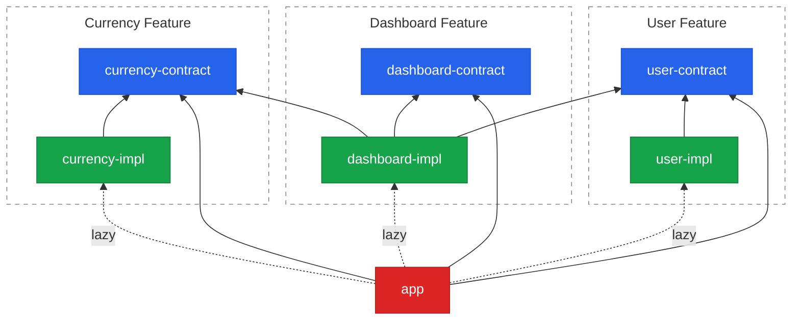

The `shared/` folder and I have a complicated relationship: I keep adding to it, and it keeps making my app harder to reason about. This post is my attempt at couples therapy.

The whole post fits in one sentence: **split the app by business feature, let features depend only on each other's *contracts* (never their implementations), and wire everything up in one place.** The bonus — and on the frontend this is the good part — is that the same boundary keeps your code splitting from quietly falling apart.

<!--more-->

## Problem: the `shared/` black hole

Every frontend codebase grows the same organ: a folder called `shared/`, or `utils/`, or `common/`. It starts empty and reasonable, then becomes the cheapest place to put anything more than one screen touches. Give it a year and it has its own gravity — new code falls in, `import` statements bend toward it, and light stops escaping.

Two costs show up as it grows:

- **Cognitive load.** Everything imports from `shared/`, and `shared/` slowly imports from everything. The dependency graph stops being a tree and becomes a hairball.
- **Ownership.** "Shared" means everyone owns it, which in practice means nobody does. There's no name to put in `CODEOWNERS`.

That part isn't specific to React. But a few things make it *worse* on the frontend:

- **Every tutorial teaches package-by-layer.** `components/`, `hooks/`, `services/`, `utils/` is the default shape of `src/`. A single "user" feature gets smeared across five folders, none of which is actually *about* users. The dumping ground isn't an accident — it's the scaffold you started from.
- **Nothing physically stops an import.** TypeScript has no package-private visibility. `import { UserService } from '../../features/user/UserService'` compiles and ships. "Don't import that" is a code-review opinion, not a rule the machine enforces. (Barrel `index.ts` files don't help either — they re-export everything and break tree-shaking; [tkdodo explains why](https://tkdodo.eu/blog/please-stop-using-barrel-files){:target="_blank"}.)
- **Coupling has a runtime price.** This is the one that stings. You set up a clean `React.lazy` code split, feel good about it, and then months later someone adds one innocent static import from a shared module. The split quietly collapses back into the main chunk. The build passes, the tests pass, nobody notices — the only symptom is a slightly bigger download.

The fix for all of it is one change of axis: **organize by business feature, not by technical layer** — and put a boundary around each feature strong enough that the bundler respects it too.

## Solution: features depend on contracts, not implementations

The idea is the "D" in SOLID, the [Dependency Inversion Principle](https://en.wikipedia.org/wiki/Dependency_inversion_principle){:target="_blank"}. And yes — we frontend folks never get the SOLID pop quiz; the interview has more pressing matters, like `==` vs `===` and whether you can center a div under pressure. This one still earns its keep:

> High-level modules should not depend on low-level modules. Both should depend on abstractions.

In plain terms: **a feature depends on what another feature *promises* (its contract), never on how it *does it* (its implementation).**

The [demo](https://github.com/gaevoy/gaev-modular-arch/tree/main/react){:target="_blank"} has three features — **User**, **Currency**, and **Dashboard** — laid out with npm workspaces. Each feature is two packages, and the app is a third kind:

| Type | Allowed dependencies | Contains |
|---|---|---|
| `*-contract` | none | interfaces, props types, hook types, IoC symbols |
| `*-impl` | own contract + other contracts + container | services, components, hooks, `register.ts` |
| `@gaev/app` | container + all contracts | `bootstrap.ts`, `App.tsx` |

The whole architecture falls out of that table. Solid arrows are static, build-time dependencies; dashed arrows are lazy runtime loads through a dynamic `import()`:



**Legend:** blue — contract · green — impl · red — app (wiring). Every solid arrow points at a contract; the only arrows into an impl are dashed. Notice `dashboard-impl` depends on `user-contract` and `currency-contract`, never on their impls.

### The contract is the public API

A contract package is pure TypeScript — it describes *what a feature is* and nothing about how it works. Here are the two most React-flavoured pieces, a component's props and a hook's signature:

```ts
// user-contract/src/UserAvatarProps.ts — a component
export interface UserAvatarProps {
    userId: string;
    size?: 'sm' | 'md' | 'lg';
}
export const USER_AVATAR = Symbol.for('@gaev/user/USER_AVATAR');

// user-contract/src/UseCurrentUser.ts — a hook
export type UseCurrentUser = () => { user: IUser | null; loading: boolean };
export const USE_CURRENT_USER = Symbol.for('@gaev/user/USE_CURRENT_USER');
```

Each concept is a type plus a symbol to resolve it by. One nice property: **the contract never imports React** — the props are a plain object type, so the contract stays a pure description that anything can read and any test can check without a renderer.

### The implementation stays private

The concrete code lives in the impl package, and it hides itself well. Since TypeScript can't mark a module "internal", the demo does the next best thing: the entry point of an impl package exports *nothing at all*. `user-impl/src/index.ts` is a single line:

```ts
import './register';
```

There's no name to import, so nobody can reach in and grab `UserService` or `UserAvatar` directly. It's the same file name as the barrel from the Problem section, doing the exact opposite job.

The `register.ts` it pulls in is where the feature binds its contract symbols to concrete values:

```ts
container.bind<IUserService>(USER_SERVICE).toDynamicValue(() => new UserService());
container.bind<ComponentType<UserAvatarProps>>(USER_AVATAR).toConstantValue(UserAvatar);
container.bind<UseCurrentUser>(USE_CURRENT_USER).toConstantValue(useCurrentUser);
```

The React-specific twist: **components and hooks are container values too**, not just services. Usually dependency injection stops at services; here it covers the UI, so a component from another feature arrives the same way a service does. And no decorators anywhere.

### The container glues contracts to implementations

Everything is resolved through a small IoC container wrapping [inversify](https://inversify.io/){:target="_blank"} — [one short file](https://github.com/gaevoy/gaev-modular-arch/blob/main/react/container/src/index.ts){:target="_blank"}. It does two things: `registerBundle` declares which symbols live in a lazy chunk and how to fetch it, and `resolveAsync` fetches it on demand (once, then caches).

That's also what makes **cross-feature calls** work: when one feature needs another, it asks the container for a contract symbol — never for the other feature's code. `DashboardWidget.tsx` pulls a component *and* two services from the User and Currency features, resolving them once at module scope with a top-level `await`:

```tsx
const [UserAvatar, userService, currencyService] = await Promise.all([
  resolveAsync<ComponentType<UserAvatarProps>>(USER_AVATAR),
  resolveAsync<IUserService>(USER_SERVICE),
  resolveAsync<ICurrencyService>(CURRENCY_SERVICE),
]);

export const DashboardWidget: React.FC<DashboardWidgetProps> = ({ defaultAmount = 100 }) => {
  // …useState + useEffect calling userService and currencyService
  return <UserAvatar userId={user.id} size="md" />;
};
```

Because the `await` runs once when the module loads — not on every render — by the time React calls the component, the dependencies are plain constants. No loading flags, no wrapper component whose only job is to fetch the thing the real component needs.

The same trick even lets you use *another feature's hook* cleanly: resolve it at module scope and it's just a function you can call at the top of your component, no Rules-of-Hooks gymnastics. ([DashboardPage.tsx](https://github.com/gaevoy/gaev-modular-arch/blob/main/react/features/dashboard/dashboard-impl/src/DashboardPage.tsx){:target="_blank"} shows it.)

### The app bootstraps and routes

Exactly one file is allowed to say the word "impl": `app/src/bootstrap.ts`. And even there, the impl only appears inside a `() => import(...)` that hasn't run yet:

```ts
export function bootstrap(): void {
  registerBundle(USER_SYMBOLS, () => import('@gaev/user-impl'));
  registerBundle(CURRENCY_SYMBOLS, () => import('@gaev/currency-impl'));
  registerBundle(DASHBOARD_SYMBOLS, () => import('@gaev/dashboard-impl'));
}
```

Adding a feature is one line here. Everything else in the app deals in contracts and symbols.

Routing works the same way — `App.tsx` has no page files. It resolves each page from the container by symbol, wraps that in `React.lazy`, and lets `<Suspense>` show the loading state while the feature chunk arrives:

```tsx
// turn a contract symbol into a lazy page component
const createLazyPage = (symbol: symbol) =>
  React.lazy(async () => ({
    default: await resolveAsync<ComponentType>(symbol),
  }));

const UserPage = createLazyPage(USER_PAGE);
const DashboardPage = createLazyPage(DASHBOARD_PAGE);

export function App() {
  return (
    <HashRouter>
      <nav>
        <Link to="/user">User</Link>
        <Link to="/dashboard">Dashboard</Link>
      </nav>
      <Suspense fallback={<p>Loading…</p>}>
        <Routes>
          <Route path="/user" element={<UserPage />} />
          <Route path="/dashboard" element={<DashboardPage />} />
        </Routes>
      </Suspense>
    </HashRouter>
  );
}
```

When you hit `/dashboard`, `resolveAsync(DASHBOARD_PAGE)` fetches the `dashboard-impl` chunk on demand, `React.lazy` renders it once it lands, and `<Suspense>` covers the wait. The app never names the page component or its file — it only ever holds the symbol.

### The boundary protects the code split — it doesn't create it

This is the payoff, and it's worth being precise about. **The architecture doesn't produce the code splitting. It protects it.** Three separate things line up:

1. Vite's `manualChunks` creates a chunk per `*-impl` — one regex, no per-feature config.
2. The dynamic `import()` in `bootstrap.ts` makes each chunk lazy — plain `React.lazy` gives you that already.
3. The contract boundary is what stops the split from silently collapsing — the only part DIP contributes, and the part worth having.

In a normal React app, code splitting is fragile: one careless static import from a lazy module folds that feature back into the main chunk, and nothing tells you. Here the natural way to reach another feature is a package import like `import { UserService } from '@gaev/user-impl'` — and it simply can't happen, because `user-impl` isn't in the app's dependencies. You can watch it in the Network tab of the [demo](https://github.com/gaevoy/gaev-modular-arch/tree/main/react){:target="_blank"}: the root page ships zero feature code, and each route pulls only its own chunk.

### The folder is the feature

Bundles aside, there's a win here for the humans. A feature is now one folder — contract, impl, and a README side by side — and that turns out to be exactly the unit teams work in. One folder means one `CODEOWNERS` entry, one owner, one place to look when something breaks. It's a tidy unit for AI tooling too: a single feature fits in the context window on its own, without dragging the rest of the app in with it.

### How the boundary is enforced

None of this holds by good intentions. Two mechanisms keep it honest:

- **The workspace dependency graph** (the strong one). `user-impl`'s `package.json` simply doesn't list a currency package, so an import from `@gaev/currency-impl` has nothing to resolve to. You can't import what isn't there.
- **ESLint.** A set of `ARCH_*` rules enforce the rest — catching things like "a contract must not import React" or "app must not statically import an impl". The rule IDs show up right in the editor's error message, and the [full set is in the repo](https://github.com/gaevoy/gaev-modular-arch/blob/main/react/eslint.config.js){:target="_blank"}.

Be straight about the guarantee, though: `tsc` will happily compile a deep relative import into another feature's impl — nothing in the *language* refuses it. What holds the line is the workspace graph plus ESLint, and that only works if `npm run lint` actually runs in CI. If it doesn't, nothing fails the build when someone crosses the boundary — the rule is still written down, but no machine is checking it anymore.

## How this compares

This isn't the only way to draw frontend boundaries, and most of the alternatives are good. The one that belongs on the far side of a line is **micro-frontends**: everything else here organizes *one* build, while micro-frontends split into *many* — separate builds composed at runtime, with all the version-drift and shared-React overhead that brings. The mainstream advice is a modular monolith by default, micro-frontends only when independent deployment is a genuine requirement.

| Approach | Organizing idea | Trade-off |
|---|---|---|
| **`shared/` + folder-by-layer** (*the "before"*) | `components/`, `hooks/`, `services/` | Familiar; but features smeared across layers, `shared/` becomes a dumping ground, no owner |
| [Feature-Sliced Design](https://feature-sliced.design/){:target="_blank"} | Layers × slices; public API per slice | Real, lintable methodology — but convention + linter, not the module system, and silent on bundling |
| [Nx `enforce-module-boundaries`](https://nx.dev/docs/features/enforce-module-boundaries){:target="_blank"} | Tag libraries, declare allowed deps | Mature and CI-friendly; buys the whole Nx toolchain |
| [dependency-cruiser](https://github.com/sverweij/dependency-cruiser){:target="_blank"} / [Sheriff](https://sheriff.softarc.io/){:target="_blank"} | Rule engine over the import graph | Flexible; still advisory — it reports, it doesn't refuse |
| [Module Federation](https://module-federation.io/){:target="_blank"} / micro-frontends | Separate builds composed at runtime | True independent deploys; heavy — right answer only when that's a hard requirement |
| **Contract-First Modular Frontend** (this post) | Feature = contract + impl, wired in a composition root | One folder = one owner; the split can't silently collapse; costs more packages and an IoC container in the initial bundle |

These compose more than they compete — Feature-Sliced Design answers *how do I organize files inside a feature*; this pattern answers *how do I stop features reaching into each other*. Run FSD inside a feature's impl if you like; the contract at the edge doesn't care.

## One gotcha worth the whole section

**Rollup can hide your container inside a feature chunk.** The container is shared by everyone, so it should live in its own chunk. But unless you tell Rollup that explicitly (with a `manualChunks` rule), it may tuck `@gaev/container` inside one of the feature chunks — usually `user-impl`. Now the app can't start without loading that feature, so the whole User feature downloads on every route, even ones that never use it. The architecture was correct; the bundler quietly worked around it.

That's the real lesson, and it's the frontend's version of the whole post: **the boundary isn't done until you've checked what actually shipped.**

## Takeaways

- Don't feed the `shared/` black hole — it's the cheapest place to drop code and the most expensive place to own it.
- Slice by business feature, not technical layer. One folder per feature, contract and implementation together.
- Contracts are the only thing features share — plain TypeScript interfaces and symbols, no React, no implementation.
- An impl package whose `index.ts` exports nothing has no name for anyone to import, so there's no way around the container.
- Code splitting is easy to get and easy to lose. The contract boundary protects a split you already have; it doesn't create one.
- Enforcement is ESLint plus the workspace dependency graph — put it in CI, and know its limits.
- It composes with Feature-Sliced Design rather than replacing it.
- Spend this much structure only where the app has earned it — several features, more than one team, bundles you actually watch. Below that line, a plain feature folder is a fine, considered choice.

## Useful Links

- [Source code](https://github.com/gaevoy/gaev-modular-arch/tree/main/react){:target="_blank"} — the full React demo: three features, the container, and the ESLint rules
- [.NET version of this idea]() — the same boundary, enforced by project references
- [Dependency Inversion Principle](https://en.wikipedia.org/wiki/Dependency_inversion_principle){:target="_blank"} and [SOLID](https://en.wikipedia.org/wiki/SOLID){:target="_blank"}
- [Please Stop Using Barrel Files](https://tkdodo.eu/blog/please-stop-using-barrel-files){:target="_blank"} — tkdodo, on why an `index.ts` re-export is not a boundary
- [Feature-Sliced Design](https://feature-sliced.design/){:target="_blank"} and [Steiger](https://github.com/feature-sliced/steiger){:target="_blank"} — the methodology and its linter
- [Nx `enforce-module-boundaries`](https://nx.dev/docs/features/enforce-module-boundaries){:target="_blank"} — tag-based boundary rules for a monorepo
- [dependency-cruiser](https://github.com/sverweij/dependency-cruiser){:target="_blank"} and [Sheriff](https://sheriff.softarc.io/){:target="_blank"} — rule engines over the import graph
- [inversify](https://inversify.io/){:target="_blank"} — the IoC container the demo wraps
- [Module Federation](https://module-federation.io/){:target="_blank"} — the micro-frontend answer, for when independent deploys are the requirement
- [Modular Monolith Primer](https://www.kamilgrzybek.com/blog/posts/modular-monolith-primer){:target="_blank"} — the same boundary idea, one level up

Have you drawn a hard feature boundary in a frontend — with a container, a linter, workspace packages, or something else? Did it survive the second team joining? I'd love to hear what held and what leaked. Drop a comment below.
